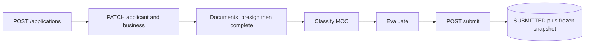

# Merchant Onboarding & Underwriting Intake API

Serverless backend that takes a merchant from "new application" to a frozen, reviewable submission: applicant and business data, document upload, MCC classification, explainable evaluation, and a final submit step that produces a normalized internal review payload.

- Compute: AWS Lambda only (Python 3.13), one function per endpoint
- API: Amazon API Gateway (REST)
- Data: DynamoDB single table (`MerchantOnboarding`)
- Documents: private S3 bucket, direct upload with presigned URLs
- IaC: AWS SAM (`template.yaml`)
- Validation: Pydantic v2
- Tests: pytest + moto (no real AWS calls)

This is an intake and decision-support prototype. It does not perform identity verification, credit decisions or sanctions screening, and it never auto-approves a merchant.

## Quick start

Prerequisites: Python 3.13. The AWS SAM CLI and AWS credentials are only needed to build or deploy; Docker is only needed for `sam local`.

```bash
python -m venv .venv
# Windows PowerShell
.venv\Scripts\Activate.ps1
# macOS/Linux
# source .venv/bin/activate

pip install -r requirements.txt
```

### Run the tests

```bash
pytest
```

The tests run against moto (mocked DynamoDB and S3) and use fixture data only.

### Run the demo (no AWS account needed)

```bash
python scripts/demo_flow.py
```

The demo runs the whole journey through the real Lambda handlers in-process: create, applicant, business, three documents (presign, direct upload, complete), MCC suggestion and confirmation, evaluation, submit, a second submit (409), and a slow-dependency demonstration. A captured run is in [`docs/demo-output.txt`](docs/demo-output.txt).

### Validate the MCC data

```bash
python scripts/validate_mcc_catalog.py
```

## Documentation

| Document | Contents |
|----------|----------|
| [`docs/ARCHITECTURE.md`](docs/ARCHITECTURE.md) | Diagrams, request flow, S3 upload path, DynamoDB items and access patterns, timeouts, failure states, retention design |
| [`docs/openapi.yaml`](docs/openapi.yaml) | API specification (OpenAPI 3.0) |
| [`docs/MCC.md`](docs/MCC.md) | MCC catalog, search and suggestion behavior, risk policy, refresh process |
| [`docs/TEST-EVIDENCE.md`](docs/TEST-EVIDENCE.md) | Test coverage and the 45-second timeout evidence |
| [`docs/demo-output.txt`](docs/demo-output.txt) | Captured demo walkthrough |
| [`SECURITY.md`](SECURITY.md) | Security controls, threats, production hardening |
| [`AI-USAGE.md`](AI-USAGE.md) | How AI assistance was used, and the bugs it produced and the tests caught |

## API

| Method | Path | Purpose |
|--------|------|---------|
| POST | `/applications` | Create an application (supports `Idempotency-Key`) |
| GET | `/applications/{id}` | Full normalized state, for resume and review |
| PATCH | `/applications/{id}/applicant` | Create or update a person (owner or control person) |
| PATCH | `/applications/{id}/business` | Create or update the business |
| POST | `/applications/{id}/documents/presign` | Get a presigned S3 upload URL |
| POST | `/applications/{id}/documents/{documentId}/complete` | Confirm the upload |
| GET | `/mcc?query=` | Search the MCC catalog |
| POST | `/applications/{id}/classify` | Propose, confirm or correct the MCC |
| POST | `/applications/{id}/evaluate` | Run the business and rate evaluation |
| GET | `/applications/{id}/evaluation` | Read the stored evaluation |
| POST | `/applications/{id}/submit` | Validate, lock and produce the review payload |

Full request and response shapes are in [`docs/openapi.yaml`](docs/openapi.yaml).

### Resume and review

`GET /applications/{id}` returns the application metadata plus the business, persons, documents, MCC classification and evaluation captured so far, a `missingItems` list, and `readyToSubmit`. A client uses it to resume a partially completed application and to render the final review screen.

### Submit

`POST /applications/{id}/submit` blocks with **400** and an explicit list when required items are missing:

```json
{
  "error": {"code": "SUBMISSION_INCOMPLETE", "message": "Application is missing required items for submission"},
  "missingItems": ["business.legal_name", "document GOVERNMENT_ID (status RECEIVED)"]
}
```

Required: business name, entity structure, tax ID, physical address and description; at least one control person; a confirmed MCC; and government ID, business registration and bank evidence documents in `RECEIVED` state. On success it returns **200** with `status: SUBMITTED`, `submittedAt` and the frozen `snapshot`. A second submit returns **409**.

### Example

```bash
curl -s -X POST http://127.0.0.1:3000/applications \
  -H "Content-Type: application/json" \
  -H "Idempotency-Key: 9f3c0a2e-demo-key" \
  -d "{}"
```

Replaying the same `Idempotency-Key` returns the same `applicationId`.

## Lifecycle



## Error shape

```json
{"error": {"code": "VALIDATION_ERROR", "message": "..."}}
```

| Situation | HTTP | code |
|-----------|------|------|
| Validation | 400 | `VALIDATION_ERROR` |
| Submit with missing items | 400 | `SUBMISSION_INCOMPLETE` (plus `missingItems`) |
| Missing item | 404 | `NOT_FOUND` |
| Duplicate create, stale `version`, illegal transition, double submit | 409 | `CONFLICT` |
| Unexpected, or internal deadline exceeded | 500 | `INTERNAL_ERROR`, `INTERNAL_TIMEOUT` |

Internal exception text and stack traces go to CloudWatch logs (PII redacted) and are never returned in the body.

## Key design decisions

- **Single-table DynamoDB.** One partition per application (`PK = APP#{id}`) holds metadata, persons, business, documents, classification, evaluation and the submission, so the aggregate is loaded without joins. Idempotency keys are stored hashed in the same table.
- **State machine in the database.** Transitions use `ConditionExpression`, so a repeated or concurrent call gets a 409 instead of overwriting. Updates use optimistic concurrency through `version`.
- **PII.** Tax IDs and government ID numbers are reduced to their last four characters before storage. Logs are structured JSON with redaction.
- **Documents.** Private bucket, direct upload through presigned URLs, non-guessable keys; bytes never pass through Lambda.
- **MCC and policy are separate.** The catalog is the taxonomy; the risk policy (with provider overrides) is a separate file. See [`docs/MCC.md`](docs/MCC.md).
- **AI behind an interface.** `AIAdapter` with a mock implementation. Adapter output is schema-validated and size-capped, every call runs under a hard timeout derived from the remaining deadline, and failures fall back safely. The effective rate is computed deterministically and never comes from the model.
- **Replaceable modules.** Handlers are thin; services hold pure logic; `repositories/` and `storage/` are the only modules that import boto3.

## Timeout budget

API Gateway REST APIs have a hard 29-second integration timeout that cannot be raised in this architecture. The chain is:

- API Gateway hard cap: 29s
- Lambda timeout: 28s
- Internal `DeadlineGuard`: 20s (template parameter `InternalTimeoutSeconds`)
- AI call hard timeout: remaining deadline minus a 1-second reserve

The assessment allows 45 seconds; this design is intentionally stricter because of the 29-second REST cap. Evidence: [`docs/TEST-EVIDENCE.md`](docs/TEST-EVIDENCE.md).

## Configuration

| Variable | Purpose |
|----------|---------|
| `TABLE_NAME` | DynamoDB table |
| `DOCUMENTS_BUCKET` | S3 bucket for uploaded documents |
| `LOG_LEVEL` | Logging level |
| `INTERNAL_TIMEOUT_SECONDS` | `DeadlineGuard` budget; must stay below the Lambda timeout (28s) |

These are set through `template.yaml`. No secrets are needed today because the AI adapter is a mock; a real provider's key would go in AWS Secrets Manager or SSM Parameter Store.

## Deployment and cleanup

```bash
sam validate
sam build
sam deploy --guided
```

Parameters: `TableName` (default `MerchantOnboarding`), `LogLevel`, `InternalTimeoutSeconds` (must stay below the Lambda timeout of 28s).

To run the API locally instead, `sam local start-api` serves it on `http://127.0.0.1:3000` (requires Docker and a reachable DynamoDB table and S3 bucket).

Cleanup: the documents bucket must be emptied before the stack can be deleted.

```bash
aws cloudformation describe-stack-resources --stack-name <stack-name> \
  --query "StackResources[?ResourceType=='AWS::S3::Bucket'].PhysicalResourceId" --output text
aws s3 rm s3://<bucket-name> --recursive
sam delete --stack-name <stack-name>
```

## Assumptions

- The system supports a human review; it makes no approval, identity, credit or sanctions decision.
- Money amounts are integers in minor units (cents).
- One business per application, and one or more persons.
- Statement values are supplied by the client; there is no real OCR.
- Card numbers (PAN/CVV) and online-banking credentials are never accepted or stored.
- Authentication is assumed to be handled upstream (see limitations).

## MCC Data Source

The catalog is a curated 35-code subset following the published Visa and Mastercard MCC definitions. It was entered as a static file, without a scripted import, and per-entry provenance was not recorded. Keywords are hand-written search aids. How to verify and refresh the data is described in [`docs/MCC.md`](docs/MCC.md), and `scripts/validate_mcc_catalog.py` checks the catalog and the risk policy for consistency.

## Retention and S3 lifecycle

The intended approach (S3 versioning, lifecycle rules, TTL for abandoned applications) is described in [`docs/ARCHITECTURE.md`](docs/ARCHITECTURE.md). It is a design, not implemented in this prototype.

## Known limitations

These are documented rather than hidden:

- **No web UI.** The API is exercised through `scripts/demo_flow.py` and the test suite.
- **No authentication or authorization.** Any caller who knows an application ID can read or modify it.
- **Not deployed and `sam local` not run.** Behavior is verified with moto and `sam validate`; the demo is a local simulation.
- **Upload validation is partial.** The 25 MB cap and the PDF/JPEG/PNG allowlist apply to the declared values at presign. On completion only the object's existence and actual size are read back from S3, and the actual size is not compared with the declared size. There is no file-signature check, and the checksum is client-reported.
- **Submit is not atomic.** The status update and the snapshot write are two DynamoDB calls; a single `transact_write_items` would fix it.
- **Mock AI, no OCR.** No LLM is called, and statement extraction returns an empty low-confidence placeholder.
- **MCC data.** A 35-code subset with keyword substring matching, and no scripted import.
- **Inconsistent key casing.** Nested objects in the evaluation payload use `snake_case`; the rest of the API uses `camelCase`.
- **Log noise.** Expected 409 conflicts are logged at ERROR level with a stack trace.
- **SDK retries** are not deadline-aware; production would set explicit timeouts and `max_attempts`.
