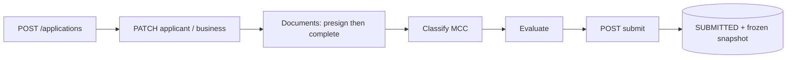
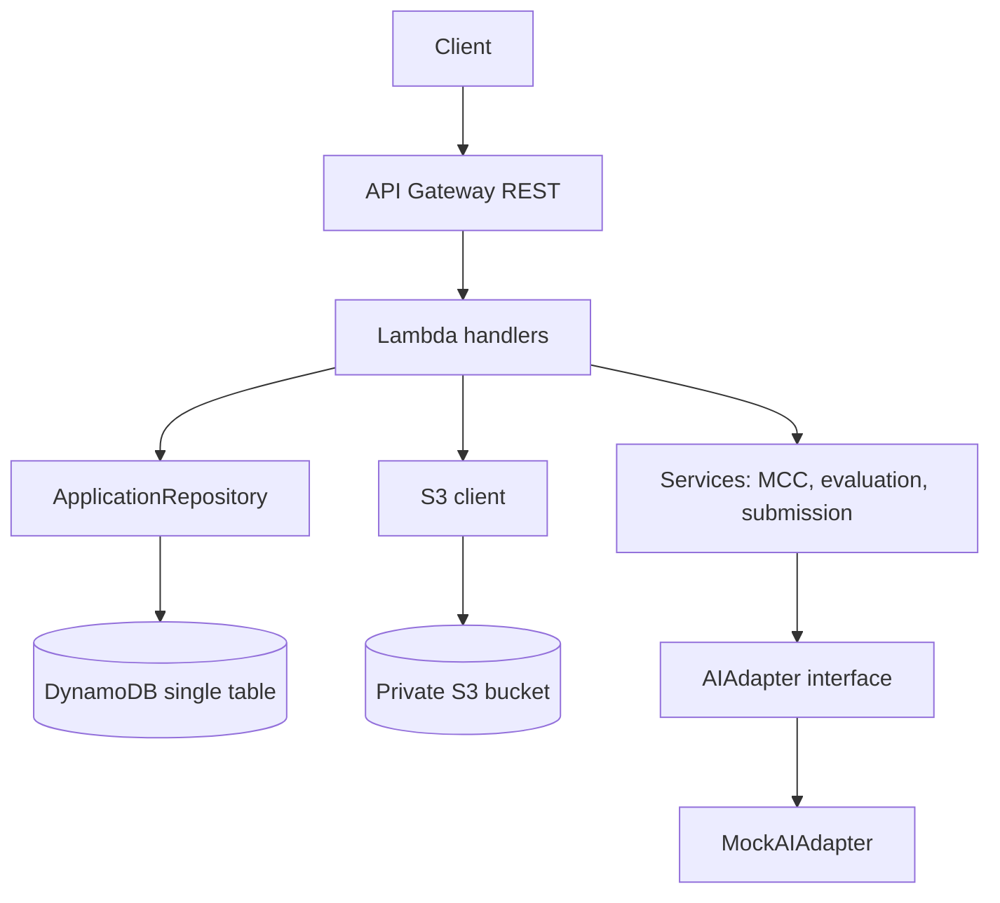

# Merchant Onboarding & Underwriting Intake API

Serverless backend that takes a merchant from "new application" to a frozen, reviewable submission: business and applicant details, document upload, MCC classification, explainable AI-assisted risk evaluation, and a final submit step that produces a normalized internal review payload.

- Compute: AWS Lambda only (Python 3.13), one function per endpoint
- API: Amazon API Gateway (REST)
- Data: DynamoDB single table (`MerchantOnboarding`)
- Documents: private S3 bucket, direct upload through presigned URLs
- IaC: AWS SAM (`template.yaml`)
- Validation: Pydantic v2
- Tests: pytest + moto (no real AWS calls), 152 tests

## Application lifecycle



Status is a small state machine (`IN_PROGRESS` -> `SUBMITTED`). Every transition is a DynamoDB conditional write, so a transition can happen exactly once even under retries or concurrent calls.

## Architecture



Layering inside `src/`:

- `handlers/` - thin Lambda entry points: parse the event, call a repository or service, map errors to HTTP responses.
- `services/` - pure business logic with no boto3 (MCC lookup, evaluation, submission validation). Easy to test without AWS.
- `repositories/` - all DynamoDB access, including the conditional writes that enforce the state machine.
- `models/` - Pydantic models and DynamoDB item shapes.
- `adapters/` - the swappable AI boundary (`AIAdapter` protocol).
- `storage/` - S3 presigned URL helper.
- `common/` - errors, response helpers, structured logging, `DeadlineGuard`, DynamoDB serialization helpers.

## API

| Method | Path | Purpose |
|--------|------|---------|
| POST | `/applications` | Create an application. Supports an `Idempotency-Key` header. |
| GET | `/applications/{id}` | Fetch application metadata. |
| PATCH | `/applications/{id}/applicant` | Add or update a person (multi-person, control person flag). |
| PATCH | `/applications/{id}/business` | Update the business profile (singleton). |
| POST | `/applications/{id}/documents/presign` | Get a presigned S3 upload URL for a document. |
| POST | `/applications/{id}/documents/{documentId}/complete` | Confirm the upload; document moves `REQUESTED` -> `RECEIVED`. |
| GET | `/mcc?query=` | Search the MCC catalog. |
| POST | `/applications/{id}/classify` | Suggest and confirm an MCC. Never auto-approves. |
| POST | `/applications/{id}/evaluate` | Run the risk evaluation. |
| GET | `/applications/{id}/evaluation` | Read the stored evaluation. |
| POST | `/applications/{id}/submit` | Validate completeness, lock the application, store the review snapshot. |

### Submit behaviour

`POST /applications/{id}/submit` returns **400** with an explicit list when required data is missing:

```json
{
  "error": {
    "code": "SUBMISSION_INCOMPLETE",
    "message": "Application is missing required items for submission"
  },
  "missingItems": [
    "business.legal_name",
    "at least one control person (PATCH /applications/{id}/applicant with is_control_person=true)",
    "document GOVERNMENT_ID (status RECEIVED)"
  ]
}
```

Required to submit: complete business fields, at least one control person, a confirmed MCC, and three documents in `RECEIVED` state (government ID, business registration, bank evidence).

On success it returns **200** with the final status, `submittedAt`, and the snapshot. A second submit on the same application returns **409**.

```json
{
  "applicationId": "<uuid>",
  "status": "SUBMITTED",
  "submittedAt": "2026-09-19T00:00:00Z",
  "snapshot": { "application": {}, "business": {}, "persons": [], "documents": [], "classification": {}, "evaluation": {} }
}
```

### Example: create and fetch

```bash
curl -s -X POST http://127.0.0.1:3000/applications \
  -H "Content-Type: application/json" \
  -H "Idempotency-Key: 9f3c0a2e-demo-key" \
  -d "{}"
```

Expected: HTTP 201

```json
{
  "applicationId": "<uuid>",
  "status": "IN_PROGRESS",
  "version": 1,
  "createdAt": "2026-09-16T07:00:00Z",
  "updatedAt": "2026-09-16T07:00:00Z"
}
```

Replaying the same `Idempotency-Key` returns the same `applicationId` (no duplicate row).

```bash
curl -s http://127.0.0.1:3000/applications/<applicationId>
```

## Error shape

All failures use the same envelope:

```json
{"error": {"code": "VALIDATION_ERROR", "message": "..."}}
```

| Situation | HTTP | code |
|-----------|------|------|
| Validation | 400 | `VALIDATION_ERROR` |
| Submit with missing items | 400 | `SUBMISSION_INCOMPLETE` (plus `missingItems`) |
| Missing item | 404 | `NOT_FOUND` |
| Duplicate create, stale `version`, illegal state transition, double submit | 409 | `CONFLICT` |
| Unexpected | 500 | `INTERNAL_ERROR` |

Internal exception text and stack traces are logged as JSON to CloudWatch (PII redacted) and never returned in the body.

## Key design decisions

**Single-table DynamoDB.** One partition per application (`PK = APP#{applicationId}`). Metadata (`SK = METADATA`), business, persons, documents, classification, evaluation and the submission (`SK = SUBMISSION`) share that partition, so the whole aggregate loads with one `Query` and no joins. Idempotency keys use a separate item type in the same table (`PK = IDEM#{sha256(key)}`), which avoids a GSI and stores a hash instead of the raw header.

**State machine enforced in the database.** Transitions (`IN_PROGRESS` -> `SUBMITTED`, document `REQUESTED` -> `RECEIVED`) use `ConditionExpression`, not read-then-write checks in application code. A losing concurrent request gets a 409 instead of silently overwriting.

**Optimistic concurrency.** Update endpoints check `version` and increment it in the same `SET`.

**PII handling.** Sensitive identifiers (tax ID, personal IDs) are stored and returned masked to the last four characters. Logs are structured JSON with redaction.

**Documents.** The bucket is private. Uploads go straight to S3 through presigned URLs with non-guessable object keys, so file bytes never pass through Lambda.

**MCC classification is deterministic.** A 35-code catalog (`src/data/mcc_catalog.json`) plus a separate `risk_policy.json` (base policy and per-provider overrides). Keyword matching, no model call. Classification never auto-approves anything; a person confirms the MCC.

**AI evaluation behind an interface.** `AIAdapter` is a protocol; the shipped implementation is `MockAIAdapter` (no LLM is called in this repository). The adapter output is schema-validated, size-capped, timeout-guarded, and fails safe. The numeric `effective_rate_percent` is computed deterministically and kept fully separate from the AI commentary. Risk signals are one of five explainable types, and each cites the `source_fields` it came from.

**Submission snapshot.** On submit, business, persons, documents, classification and evaluation are frozen into one normalized record. A future processor-mapping job reads that single structure instead of re-querying live data the applicant could still change.

**DynamoDB float safety.** DynamoDB rejects Python floats. `common/dynamo_utils.py` provides a recursive float -> `Decimal` converter, used by every model that writes free-form data.

## Timeout budget

API Gateway REST APIs have a hard 29-second integration timeout that cannot be raised in this architecture. If Lambda runs longer, API Gateway returns a 504 before Lambda's own timeout matters. The chain is therefore:

- API Gateway REST hard cap: 29s
- Lambda function timeout: 28s
- Internal `DeadlineGuard` budget: 20s, leaving headroom for serialization and cleanup

The assessment allows 45s overall; this design is intentionally tighter because of the 29s REST cap.

## Configuration

| Variable | Purpose |
|----------|---------|
| `TABLE_NAME` | DynamoDB table (default `MerchantOnboarding`) |
| `DOCUMENTS_BUCKET` | S3 bucket for uploaded documents |
| `LOG_LEVEL` | Logging level |
| `INTERNAL_TIMEOUT_SECONDS` | `DeadlineGuard` budget; must stay below the Lambda timeout (28s) |

These are wired through `template.yaml` parameters and environment settings.

## Getting started

Prerequisites:

- Python 3.13 (matches the Lambda runtime, so `sam build` does not need Docker on a matching machine)
- [AWS SAM CLI](https://docs.aws.amazon.com/serverless-application-model/latest/developerguide/install-sam-cli.html)
- AWS credentials, only needed to deploy
- Docker, only needed for `sam local start-api` or container builds

Install (from the repo root):

```bash
python -m venv .venv
# Windows PowerShell
.venv\Scripts\Activate.ps1
# macOS/Linux
# source .venv/bin/activate

pip install -r requirements.txt
```

Lambda dependencies come from `src/requirements.txt` during `sam build` (Pydantic). `boto3` is provided by the Lambda runtime.

### Run the tests

```bash
pytest
```

`tests/conftest.py` puts `src/` on the import path and provides moto-backed `dynamodb_table` and `documents_bucket` fixtures, so no AWS account or credentials are needed.

- `tests/unit/` - handlers (with fake repositories), services, repositories (moto)
- `tests/integration/` - multi-step flows through the handlers on moto

### Validate and build

```bash
sam validate
sam build
```

### Run locally

```bash
sam local start-api
```

The API listens on `http://127.0.0.1:3000`. Local invoke needs a reachable DynamoDB table and S3 bucket (for example DynamoDB Local, or a deployed stack).

### Deploy

```bash
sam deploy --guided
```

Parameters: `TableName` (default `MerchantOnboarding`), `LogLevel`, `InternalTimeoutSeconds` (must stay below the Lambda timeout of 28s).

## Known limitations

These are documented rather than hidden:

- **No authentication or authorization.** The API is open. Before any production traffic, add Amazon Cognito, IAM auth, or a Lambda authorizer.
- **No real OCR.** `MockAIAdapter.extract_statement` always returns an empty, low-confidence placeholder. Statement analysis is only produced when the client supplies the values directly.
- **Mock AI provider.** No LLM is called. The adapter interface is the extension point for a real provider.
- **Client-reported document checksum.** `checksum_sha256` on document completion is supplied by the client and not re-verified server-side.
- **Submit is not atomic.** `submit_application` performs the status update and the snapshot write as two separate DynamoDB calls. If the second fails after the first succeeds, the application is `SUBMITTED` without a stored snapshot. The fix is a single `transact_write_items` call (conditional update plus put).
- **Inconsistent key casing in evaluation output.** Nested objects in `EvaluationRecord.to_public_dict()` (`businessProfile`, `statementAnalysis`, `riskSignals`) use `snake_case`, while the rest of the API uses `camelCase`.
- **Local API emulation not exercised.** Behaviour is verified by the moto test suite and `sam validate`.

## Documentation

- [`AI-USAGE.md`](AI-USAGE.md) - how AI assistance was used, representative prompts, and bugs found and fixed
- [`SECURITY.md`](SECURITY.md) - security posture and threat notes