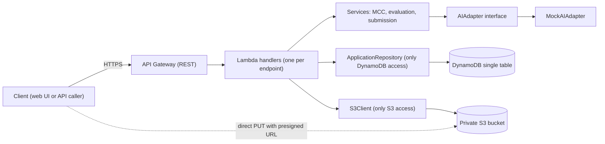
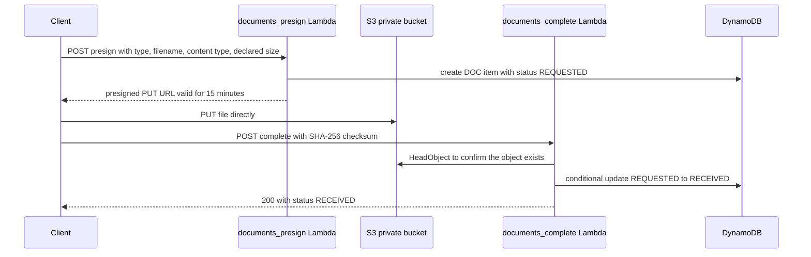
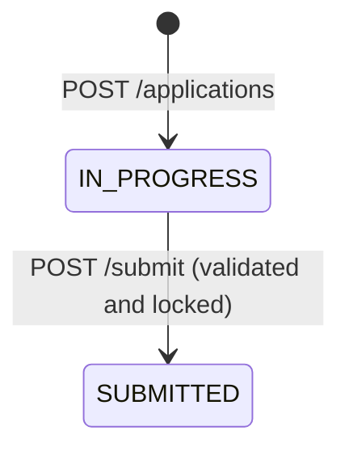
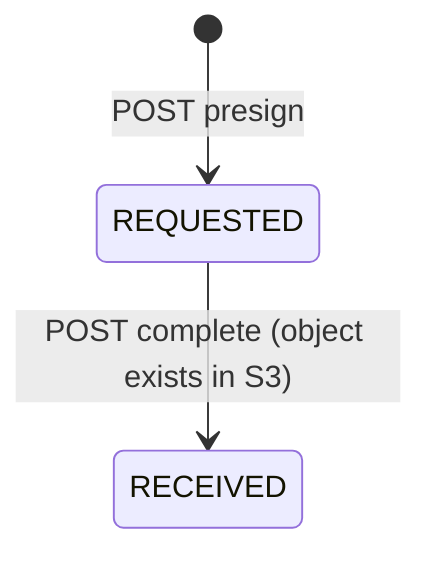

# Architecture

Serverless merchant onboarding intake: API Gateway in front of one Lambda function per endpoint, DynamoDB for metadata and workflow state, a private S3 bucket for documents. All backend compute is AWS Lambda; there is no always-on server.

## System overview



Key property: document bytes never pass through Lambda. The client uploads straight to S3 with a presigned URL, so Lambda is never held open by a slow upload.

## Request flow

1. The client calls an API Gateway route over HTTPS.
2. API Gateway invokes the Lambda handler for that route.
3. The handler starts a `DeadlineGuard`, configures structured logging (correlation ID = Lambda request ID, plus the application ID), and validates the path and body with Pydantic.
4. It calls a repository (DynamoDB), the S3 client, or a service (pure business logic), checking the deadline before every remote call.
5. Errors map to one JSON envelope (`{"error": {"code", "message"}}`); internal details go only to CloudWatch logs.

Layering: `handlers/` (thin entry points) -> `services/` (pure logic, no boto3) -> `repositories/` and `storage/` (the only modules that import boto3). `adapters/` holds the AI boundary. This keeps storage, the AI provider, and business policy replaceable.

## S3 upload path



- Presign validates the document type, filename length, declared size (max 25 MB) and content type (PDF, JPEG, PNG only).
- Object keys are `applications/{applicationId}/documents/{documentId}.{ext}` with a UUID document ID and a sanitized extension. The key layout is never returned to clients.
- `/complete` refuses (400) if no object exists yet, so the document stays `REQUESTED`.

## DynamoDB design

Single table `MerchantOnboarding`, `PK` (string) and `SK` (string). One partition per application, so the whole aggregate loads with one `Query`.

| Item | PK | SK |
|------|----|----|
| Application metadata | `APP#{applicationId}` | `METADATA` |
| Person (owner or control person) | `APP#{applicationId}` | `PERSON#{personId}` |
| Business (singleton) | `APP#{applicationId}` | `BUSINESS` |
| Document | `APP#{applicationId}` | `DOC#{documentId}` |
| MCC classification (singleton) | `APP#{applicationId}` | `MCC_CLASSIFICATION` |
| Evaluation (singleton) | `APP#{applicationId}` | `EVALUATION` |
| Submission snapshot (singleton) | `APP#{applicationId}` | `SUBMISSION` |
| Idempotency record | `IDEM#{sha256(key)}` | `CREATE_APPLICATION` |

Every item carries `entity_type`, `created_at`, `updated_at`, and `version`.

### Access patterns

| Pattern | Operation |
|---------|-----------|
| Load application | `GetItem` on `METADATA` |
| Load the whole aggregate (resume and review) | `GET /applications/{id}` reads each singleton item with `GetItem`, and people and documents with one `Query` each. All items share the partition key, so a single `Query` on `PK` could also load it in one round trip. |
| List people and owners | `Query` on `PK` with the person `SK` prefix |
| List documents | `Query` on `PK` with `SK` prefix `DOC#` |
| Fetch current evaluation | `GetItem` on `EVALUATION` |
| Find submission status | `GetItem` on `METADATA` (status) and `SUBMISSION` (frozen snapshot) |
| Search the MCC catalog | Packaged static JSON (`src/data/mcc_catalog.json`) searched in memory. The catalog is small, read-only, and changes only with a code deploy, so a table round trip would add latency and no value. |
| Replay a create request | `GetItem` on the idempotency item |

### Resume and review

`GET /applications/{id}` returns the application metadata plus the business, persons, documents, classification and evaluation captured so far, a `missingItems` list (the same completeness rules `submit` enforces), and `readyToSubmit`. A client can use it to resume a partially completed application and to render the final review screen.

### Consistency

- **Idempotent create.** `POST /applications` uses a hashed `Idempotency-Key` item; replaying the key returns the original application. Creates use `attribute_not_exists(PK)`.
- **State machine in the database.** Transitions (`IN_PROGRESS` to `SUBMITTED`, document `REQUESTED` to `RECEIVED`) are conditional writes, so a repeated or concurrent call gets a 409 instead of overwriting.
- **Optimistic concurrency.** Update endpoints send `expected_version`; the write checks it and increments `version` in the same `SET`.

### State machines





The spec lifecycle also has `UPLOADING`, `PROCESSING`, `ACCEPTED`, `NEEDS_REVIEW` and `REJECTED`. `UPLOADING` is the client's direct PUT to S3, which the backend cannot observe, so it is deliberately never persisted. The remaining four values exist in the enum for a future reviewer workflow but have no transitions yet.

## AI and external calls

- The evaluation service depends on an `AIAdapter` interface. The shipped implementation is `MockAIAdapter`, a deterministic keyword heuristic; no LLM is called.
- Adapter output is validated against a Pydantic schema, and input size is capped (business description at 2000 characters).
- Every adapter call runs through `_call_ai`, which enforces a hard timeout of (remaining deadline minus a 1-second reserve). If the adapter hangs, the call is abandoned and the caller falls back to a safe result with `ai_available: false`.
- The effective processing rate is plain arithmetic in `evaluation_service.py` and never comes from the AI. Risk signals are rule-based, and each cites the fields that caused it (`source_fields`).
- Nothing auto-approves. MCC confirmation and evaluation only produce flags for a human reviewer.

If a real provider needs longer than the synchronous budget, the intended path is asynchronous: move to a `PROCESSING` state and let the client poll `GET /applications/{id}/evaluation`. That is not implemented; the evaluation currently runs synchronously inside the budget.

## Timeout budget

```
API Gateway REST hard cap      29 s   (cannot be raised in this architecture)
Lambda function timeout        28 s
DeadlineGuard internal budget  20 s   (template parameter InternalTimeoutSeconds)
AI call hard timeout           remaining deadline - 1 s
```

The assessment allows 45 seconds, but a REST API returns 504 at 29 seconds, so the design is intentionally stricter. Evidence: `docs/TEST-EVIDENCE.md`.

## Failure states

| Situation | Behavior |
|-----------|----------|
| Invalid input | 400 `VALIDATION_ERROR` |
| Submit with missing items | 400 `SUBMISSION_INCOMPLETE` plus `missingItems` |
| Unknown application or document | 404 `NOT_FOUND` |
| Duplicate create, stale `version`, double submit | 409 `CONFLICT`; the client reloads state with GET |
| `/complete` before the upload | 400; the document stays `REQUESTED`; PUT the file and retry |
| AI provider slow or failing | 200 with `ai_available: false`; deterministic results intact; retry later |
| Internal deadline exhausted | 500 `INTERNAL_TIMEOUT` |
| DynamoDB or S3 error | 500 `INTERNAL_ERROR`, details in logs only |

Writes are single conditional operations, so a failed request leaves no partial state, with one exception: `submit_application` does its status update and snapshot write as two calls (see known gaps).

## Security and privacy

Details are in `SECURITY.md`. In short:

- Least-privilege IAM per function, a private S3 bucket with a public access block and encryption at rest, HTTPS only.
- Pydantic validation at every boundary; sensitive identifiers reduced to their last four characters before storage; no PII in logs.
- **KMS in production:** use SSE-KMS with a customer-managed key for the S3 bucket and the DynamoDB table (with S3 bucket keys to control cost), restrict the key policy to the specific Lambda roles, and enable key rotation. The prototype uses AWS-managed encryption.
- **Secrets:** none are needed today because the AI adapter is a mock. A real provider's API key would live in AWS Secrets Manager or SSM Parameter Store (SecureString), be read once per cold start and cached, and never appear in source or environment templates.

## Retention, versioning and cleanup (design, not implemented)

- **S3 versioning** on, so an overwritten or deleted document can be recovered.
- **Lifecycle rules:** abort incomplete multipart uploads after 1 day; expire noncurrent versions after a fixed period; expire objects under `applications/` for abandoned applications.
- **Abandoned applications:** add a TTL attribute on items of applications that remain `IN_PROGRESS` past a retention window, so DynamoDB removes them; a lifecycle rule on the same prefix removes the matching S3 objects. Submitted applications follow the retention period required by policy.
- **Full cleanup of a deployment:** empty the documents bucket, then `sam delete`.

## Observability

Logs are structured JSON with a correlation ID (the Lambda request ID) and the application ID, and PII is redacted. CloudWatch collects them.

## Known gaps

- No authentication or authorization (see `SECURITY.md`).
- `submit_application` is two DynamoDB calls, not one transaction; a `transact_write_items` call would make it atomic.
- The AWS SDK's built-in retries are not deadline-aware; production would set explicit connect/read timeouts and `max_attempts` on the boto3 client config.
- No custom CloudWatch metrics or alarms.
- No web UI. The API is exercised through `scripts/demo_flow.py` and the test suite.
- The AI adapter is a mock and there is no OCR.
- Expected 409 conflicts are logged at ERROR level with a stack trace, which adds noise.
